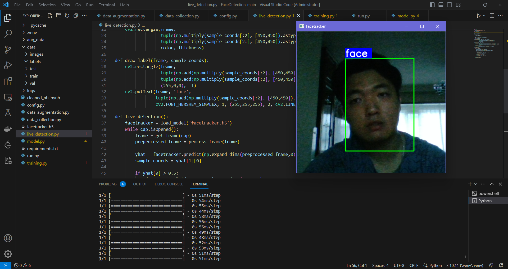

# Deep Learning and Reinforcement Learning Project Collection  

## A collection of my deep learning &amp; reinforcement related projects  

### **Still Updating...**  

## Real-time Face/ Object Detection   
[Live Face or Object Detection](https://github.com/nickShengY/face-object-detection)    

## Real-time hand gesture detection with LSTM    
[Hand Gesture](https://github.com/nickShengY/action-gesture-detection-lstm)    
      
## Emotion Classification with deep learning    
[Emotion Classification](https://github.com/nickShengY/deep-emotion)  

## Image classification with CIFAR10 dataset   
[Image Classification](https://github.com/nickShengY/CIfar10)
## Option Pricing with DDPG   
[Option Pricing](https://github.com/nickShengY/option_RL_DDPG)
## Stock Prediction with LSTM  
[Stock Predition](https://github.com/nickShengY/stock_prediction)
## Cartpole Game AI controller  
[Cartpole Game](https://github.com/nickShengY/Cartpole_AI)
## Pneumonia X-ray Classification with neural network  
[CLassification](https://github.com/nickShengY/Pneumonia_Classification)
## Fraud Detection with Q-learning  
[Fraud Detection](https://github.com/nickShengY/Fraud_detection)

